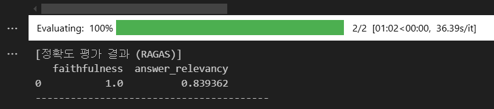
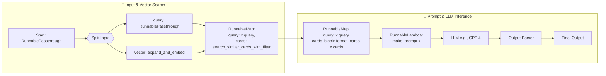

# 신용카드 추천 챗봇 시스템

## 🍀 팀명 및 팀원

**팀명**: 신용불량자  
**팀원**: 고범석, 김동욱, 우민규, 홍성의, 홍채우

<table>
  <tr>
    <td></td>
    <td></td>
    <td></td>
    <td></td>
    <td></td>
  </tr>
  <tr>
    <td><a href="https://github.com/qjazk0000">고범석</a></td>
    <td><a href="https://github.com/boogiewooki02">김동욱</a></td>
    <td><a href="https://github.com/mingyu-oo">우민규</a></td>
    <td><a href="https://github.com/seonguihong">홍성의</a></td>
    <td><a href="https://github.com/HCWDDD">홍채우</a></td>
  </tr>
</table>

## 📌 프로젝트 소개

이 프로젝트는 사용자의 질문 한 줄로 최적의 신용카드를 추천해주는 RAG 기반 AI 챗봇입니다.
카드 혜택 정보는 여러 사이트에 분산돼 있고, 각 카드사의 챗봇은 자사 카드만 추천하는 한계가 있습니다.
본 시스템은 여러 카드사의 정보를 통합하고, 자연어 질문에 대해 LLM이 문서 기반으로 응답함으로써 신뢰성 있는 카드 비교/추천을 제공합니다.

| 항목               | 설명                                                                                                                                                       |
| ------------------ | ---------------------------------------------------------------------------------------------------------------------------------------------------------- |
| 프로젝트 목표      | 사용자 요구에 따른 맞춤형 신용카드를 추천하는 대화형 RAG 기반 챗봇 구축                                                                                    |
| 기존 서비스 한계   | [카드고릴라](https://www.card-gorilla.com): 여러 카드사는 포함되지만 대화형 추천 기능 없음<br>각 카드사 사이트: 대화형 챗봇이 있어도 자사 카드만 추천 가능 |
| 본 시스템의 차별점 | 자연어 기반 대화형 카드 추천<br>여러 카드사 카드 동시 비교 가능                                                                                            |

## 🔨 기술 스택

| 항목                   | 내용                                                                                                                         |
| ---------------------- | ---------------------------------------------------------------------------------------------------------------------------- |
| **Language**           |                         |
| **Crawler**            |                   |
| **Embedding**          |  |
| **LLM Model**          |                      |
| **Collaboration Tool** |                                  |
| **Vector DB**          |                   |

---

## 📂 시스템 구성

1. **데이터 수집 및 전처리**

   - 출처: 카드고릴라의 카드 정보 페이지 (카드id 기반 URL)
   - 수집 항목: 카드명, 카드사, 브랜드(VISA, Mastercard), 연회비, 혜택, 유의사항
   - 처리 방식: Selenium으로 동적 요소 렌더링, HTML 파싱, JSON으로 저장
   - 발급 불가 카드 필터링: "신규발급이 중단된 카드입니다." 문자열 포함 데이터 수집 X
   - 혜택 분류: 주요 혜택 항목은 benefits으로 추출

2. **문서 임베딩**

   - 임베딩 모델: text-embedding-3-small (OPEN AI)
   - 벡터 DB: Pinecone DB
   - 문서 구성: 카드 설명 문장 + 혜택 요약/상세 텍스트 + 메타데이터
   - 규모: 약 1700개 문서 벡터화
   - 메타데이터: 카드명, 브랜드, 연회비 등 검색 필터링용 정보 포함

3. **Chain 구성**

```
# 코드
recommend_chain = (
    RunnablePassthrough()
    | {"query": RunnablePassthrough(), "vector": expand_and_embed}
    | RunnableMap({
        "query": lambda x: x["query"],
        "cards": search_similar_cards_with_filter
    })
    | RunnableMap({
        "query": lambda x: x["query"],
        "cards_block": lambda x: format_cards(x["cards"])
    })
    | RunnableLambda(make_prompt)
    | llm # gpt-4.1
    | parser
)
```

<!--  -->

- 사용자 입력 (query)

  - 사용자의 질문을 그대로 전달

- expand_and_embed (벡터 확장 및 임베딩)

  - 질문을 벡터로 변환하여 검색에 사용

- search_similar_cards_with_filter (유사 카드 검색)

  - 벡터 유사도 기반으로 관련 있는 카드 후보군 검색
  - 필요 시 메타데이터 필터링 포함

- format_cards (카드 정보 정리)

  - 검색된 카드 리스트를 보기 좋게 요약하여 텍스트 블록으로 구성

- make_prompt (프롬프트 생성기)

  - 질문과 카드 요약 정보를 포함한 LLM 입력 프롬프트 작성

- LLM (예: ChatOpenAI 또는 HuggingFace 모델)

  - 작성된 프롬프트를 바탕으로 추천 결과 생성

- parser (StrOutputParser)
  - LLM의 응답을 문자열로 정리하여 최종 출력

4. **RAG 성능 평가**

   - 평가 도구: **RAGAS**
   - 지표:
     - faithfulness: 응답의 문서 근거 충실도
     - answer_relevancy: 질문과 응답의 관련성
   - 평가 데이터: 사용자 입력

   

---

## 🧩 시스템 구조도



---

## 💬 예시 입력/출력

입력창

```
원하는 동작을 선택하세요:
1. 추천 결과 요약 보기
2. 재검색(새로운 쿼리)
3. 카드 홈페이지(URL) 모두 보기
4. 종료
```

예시 질문

```
"삼성카드 중에서 배달 혜택 있는 카드 알려줘"
“OTT, 통신비 혜택이 있는 카드 추천해줘”
“연회비 1만원 이하면서 스트리밍 할인 있는 카드 알려줘”
```

출력 예시

```
- 카드명: CU 배달의민족 삼성카드 taptap
- 카드사: 삼성카드
- 연회비(국내): 0원
- 브랜드: Mastercard
- 혜택:
   CU·배달의민족 삼성카드 taptap
   배달의민족 15,000원 이상 결제 시 월 3회, 건당 2,000원 청구할인(최대 6,000원)
   전월 30만원 이상 이용 시 제공, 발급 후 1개월 간 실적 조건 없음
```

---

## ⚙️ 종합 평가 및 개선 방안

1.
2.
